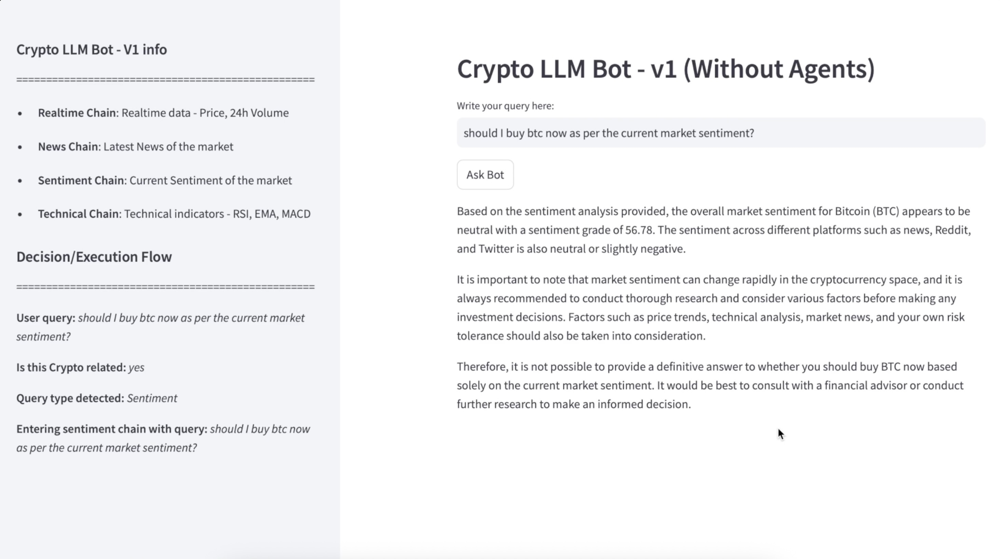
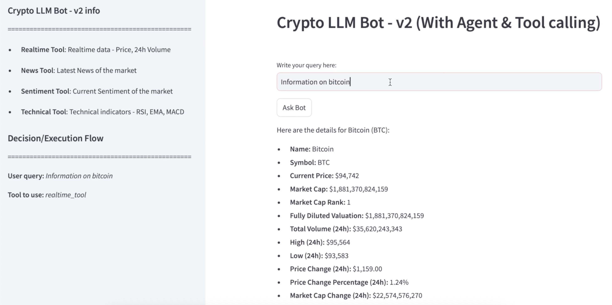

# Crypto-LLM-bot
Version 1:
This bot is designed to provide answers solely related to cryptocurrency.

The bot identifies the type of query that the user has asked and, based on that, retrieves data using APIs from various sources.

The bot categorizes user queries into four types:

- Realtime: Returns price and volume data for any cryptocurrency coin.
- News: Answers news-related queries.
- Sentiment: Provides market sentiment analysis.
- Technical: Provides technical indicators such as RSI, EMA, and MACD.

While working on this project, I realized that the segmentation of queries into these types can be easily accomplished by agents and tools. Therefore, this version of the bot (v1) is currently developed without agents.

However, there are some limitations with this approach, such as scalability. Therefore, I will work on a subsequent version (v2) that will incorporate agents. 

Run the app: streamlit run app_v1.py

Click on the thumbnail to play the demo!

------------------------------------------------------------------------------------------

Version 2:

This is the second version of the cryptocurrency language model bot. I have made some changes to the internal structure of the cryptocurrency language model bot, where instead of routing to different chains as per the user query, I am using an agent to decide which tool to use dynamically.

With this change, it overcomes the limitations of manually routing to different chains; instead, that can be well taken care of by the agent based on the tool descriptions and availability.

Now, what if we want to execute some trades based on the interaction with the cryptocurrency bot using the agent? Stay tuned for version 3!

Thank you for your valuable time reading this out !!!

Run the app: streamlit run app_v2.py

Click on the thumbnail to play the demo!

